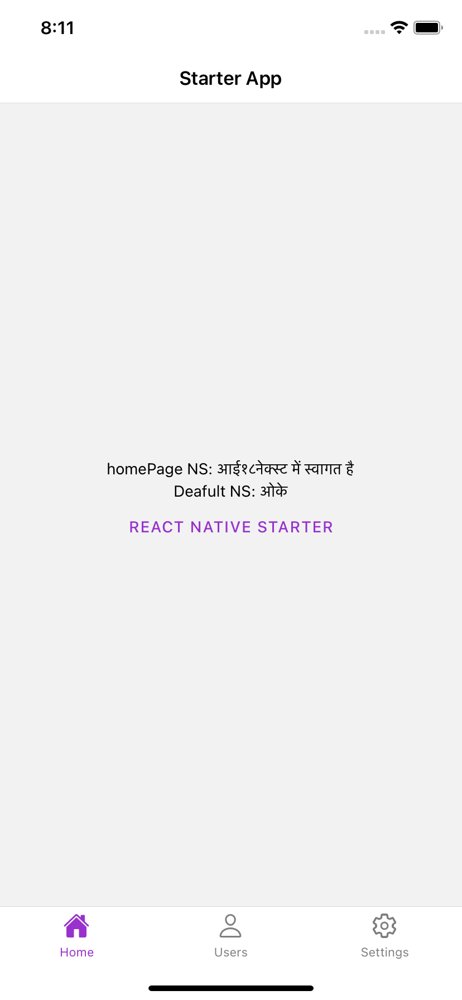
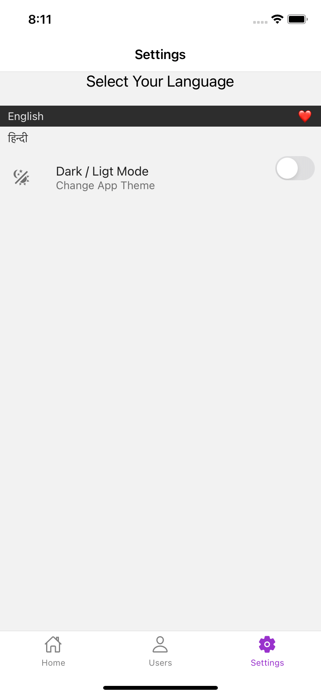

# React Native TypeScript Starter
A React Native boilerplate project using Typescript and React Navigation.
 
## Translation

This template comes with an extendable and efficient internationalization mechanism implemented using `Context`. To add more languages or translations, simply edit the `translations.json` file. By default, the supported languages are french and english.

All of which have a non themed version, if you ever need it.
 
 Home             |  Settings
:-------------------------:|:-------------------------:
  |  
|
